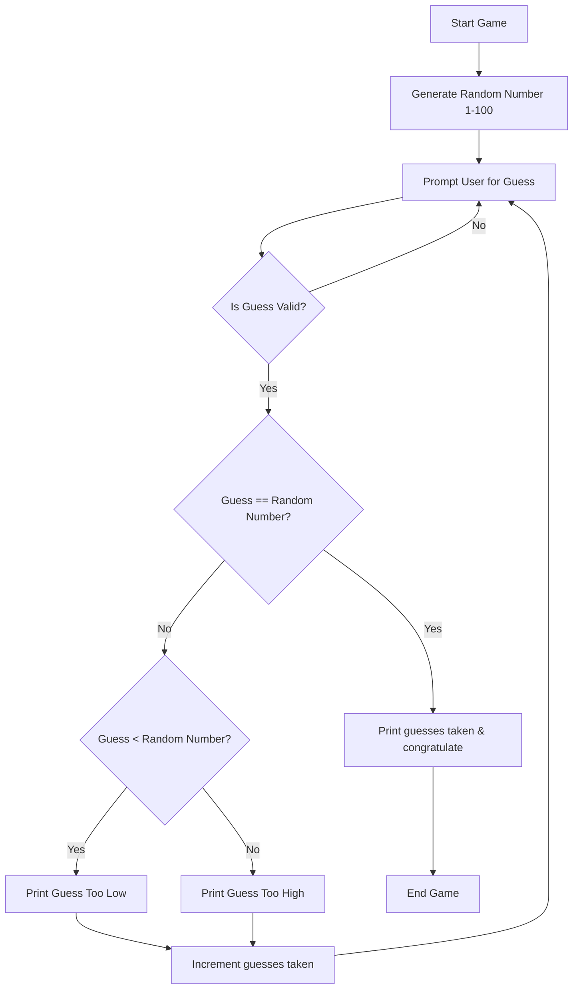

# kotlin-guessing
#### A small guessing game in kotlin

 ---
Mermaid Pseudocode:

```mermaid
graph TD
    A[Start Game] --> B[Generate Random Number 1-100]
    B --> C[Prompt User for Guess]
    C --> D{Is Guess Valid?}
    D -->|No| C
    D -->|Yes| E{Guess == Random Number?}
    E -->|Yes| F[Print guesses taken & congratulate]
    E -->|No| G{Guess < Random Number?}
    G -->|Yes| H[Print Guess Too Low]
    G -->|No| I[Print Guess Too High]
    H --> K
    I --> K
    K[Increment guesses taken] --> C
    F --> J[End Game]
    

``` 
